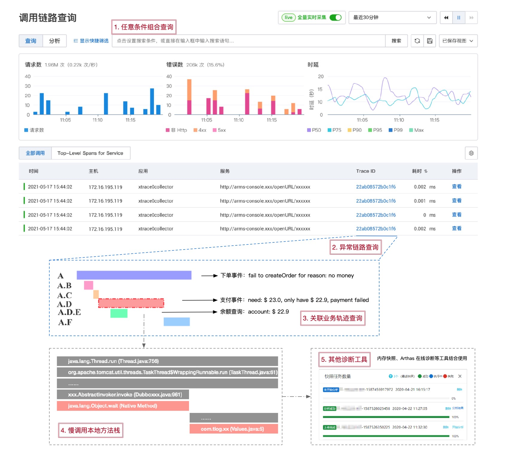

# 链路追踪（Tracing）其实很简单——多维链路筛选

> 作者：夏明（涯海）    
> 创作日期：2022-07-14  
> 专栏地址：[【稳定大于一切】](https://github.com/StabilityMan/StabilityGuide)  

上一小节我们介绍了如何通过调用链和关联信息进行问题诊断，但是，细心的读者可能会有一个疑问，整个系统有那么多的调用链，我怎么知道哪条链路才是真正描述我在排查的这个问题？如果找到了不相符的链路岂不是会南辕北辙？

没错！在使用调用链分析问题之前，还有一个很重要的步骤，就是从海量链路数据中，通过各种条件筛选出真实反应当前问题的调用链，这个动作就叫做链路筛选。那什么叫多维呢？多维是指通过 TraceId、链路特征或自定义标签等多种维度进行链路筛选。每一种筛选条件都是由日常开发/运维的场景演变而来，最为契合当下的使用方式，提高了链路筛选的效率和精准度。

## 基于链路标识 TraceId 的筛选
提到链路筛选，大家很自然的就会想到使用全局链路唯一标识 TraceId 进行过滤，这是最精准、最有效的一种办法。但是，TraceId 从哪里来？我该如何获取呢？

### 如何获取 TraceId？
其实，TraceId 贯穿于整个 IT 系统，只不过大部分时候，它只是默默配合上下文承担着链路传播的职责，没有显式的暴露出来。常见的 TraceId 获取方式有以下几种:

* **前端请求 Header 或响应体 Response：** 大部分用户请求都是在端上设备发起的，因此 TraceId 生成的最佳地点也是在端上设备，通过请求 Header 透传给后端服务。因此，我们在通过浏览器开发者模式调试时，就可以获取当前测试请求 Header 中的 TraceId 进行筛选。如果端上设备没有接入分布式链路追踪埋点，也可以将后端服务生成的 TraceId 添加到 Response 响应体中返回给前端。这种方式非常适合前后端联调场景，可以快速找到每一次点击对应的 TraceId，进而分析行为背后的链路轨迹与状态。
* **网关日志：** 网关是所有用户请求发往后端服务的代理中转站，可以视为后端服务的入口。在网关的 access.log 访问日志中添加 TraceId，可以帮助我们快速分析每一次异常访问的轨迹与原因。比如一个超时或错误请求，到底是网关自身的原因，还是后端某个服务的原因，可以通过调用链中每个 Span 的状态得到确定性的结论。
* **应用日志：** 应用日志可以说是我们最熟悉的一种日志，我们会将各种业务或系统的行为、中间状态和结果，在开发编码的过程中顺手记录到应用日志中，使用起来非常方便。同时，它也是可读性最强的一类日志，即使是非开发运维人员也能大致理解应用日志所表达的含义。因此，我们可以将 TraceId 也记录到应用日志中进行关联，一旦出现某种业务异常，我们可以先通过当前应用的日志定位到报错信息，再通过关联的 TraceId 去追溯该应用上下游依赖的其他信息，最终定位到导致问题出现的根因节点。
* **组件日志：** 在分布式系统中，大部分应用都会依赖一些外部组件，比如数据库、消息、配置中心等等。这些外部组件也会经常发生这样或那样的异常，最终影响应用服务的整体可用性。但是，外部组件通常是共用的，有专门的团队进行维护，不受应用 Owner 的控制。因此，一旦出现问题，也很难形成有效的排查回路。此时，我们可以将 TraceId 透传给外部组件，并要求他们在自己的组件日志中进行关联，同时开放组件日志查询权限。举个例子，我们可以通过 SQL Hint 传播链 TraceId，并将其记录到数据库服务端的 Binlog 中，一旦出现慢 SQL 就可以追溯数据库服务端的具体表现，比如一次请求记录数过多，查询语句没有建索引等等。

### 如何在日志中关联 TraceId？
既然 TraceId 关联有这么多的好处，那么我们如何在日志输出时添加 TraceId 呢？主要有两种方式：

* **基于 SDK 手动埋点：** 链路透传的每个节点都可以获取当前调用生命周期内的上下文信息。最基础的关联方式就是通过 SDK 来手动获取 TraceId，将其作为参数添加至业务日志的输出中。
* **基于日志模板自动埋点：** 如果一个存量应用有大量日志需要关联 TraceId，一行行的修改代码添加 TraceId 的改造成本属实有点高，也很难被执行下去。因此，比较成熟的 Tracing 实现框架会提供一种基于日志模板的自动埋点方式，无需修改业务代码就可以在业务日志中批量注入 TraceId，使用起来极为方便。

#### 基于 SDK 手动实现日志与 TraceId 关联示例
以 Jaeger Java SDK 为例，手动埋点主要分为以下几步：

1. 打开应用代码工程的 pom.xml 文件，添加对 Jaeger 客户端的依赖（正常情况下该依赖已经被添加，可以跳过）。

```
<dependency>
    <groupId>io.jaegertracing</groupId>
    <artifactId>jaeger-client</artifactId>
    <version>0.31.0</version>
</dependency>
```

2. 在日志输出代码前面，先获取当前调用生命周期的 Span 对象，再从上下文中获取 TraceId 标识。

```
String traceId = GlobalTracer.get().activeSpan().context().toTraceId();
```

3. 将 TraceId 添加到业务日志中一并输出。

```
log.error("fail to create order, traceId: {}", traceId);
```

4. 最终的日志效果如下所示，这样我们就可以根据业务关键词先过滤日志，再通过关联的 TraceId 查询上下游全链路轨迹的信息。

```
fail to create order, traceId: ee14662c52387763
```

#### 基于日志模板实现日志与 TraceId 自动关联示例
基于 SDK 手动埋点需要一行行的修改代码，无疑是非常繁琐的，如果需要在日志中批量添加 TraceId，可以采用日志模板注入的方式。目前大部分的日志框架都支持 Slf4j 日志门面，它提供了一种 MDC（Mapped Dignostic Contexts）机制，可以在多线程场景下线程安全的实现用户自定义标签的动态注入。

MDC 的使用方法很简单，只需要两步。第一步，我们先通过 MDC 的 put 方法将自定义标签添加到诊断上下文中：

```java
@Test
public void testMDC() {
	MDC.put("userName", "xiaoming");
	MDC.put("traceId", GlobalTracer.get().activeSpan().context().toTraceId());
	log.info("Just test the MDC!");
}
```

第二步，在日志配置文件的 Pattern 描述中添加标签变量 %X{userName} 和 %X{traceId}。

```xml
<appender name="console" class="ch.qos.logback.core.ConsoleAppender">
    <filter class="ch.qos.logback.classic.filter.ThresholdFilter">
        <level>INFO</level>
    </filter>
    <encoder>
        <pattern>%d{HH:mm:ss} [%thread] %-5level [userName=%X{userName}] [traceId=%X{traceId}] %msg%n</pattern>
        <charset>utf-8</charset>
    </encoder>
</appender>
```

这样，我们就完成了 MDC 变量注入的过程，最终日志输出效果如下所示：

```
15:17:47 [http-nio-80-exec-1] INFO [userName=xiaoming] [traceId=ee14662c52387763] Just test the MDC!
```

看到这里，细心的读者可能会疑问，MDC 注入不是也需要修改代码么？答案是确实需要，不过好在 Tracing 框架已经提供了简易的关联方式，无需逐行修改日志代码，极大的减少了改造量。比如 Jaeger SDK 提供了 MDCScopeManager 对象，只需要在创建 Tracer 对象时顺便关联上 MDCScopeManager 就可以实现 traceId、spanId 和 sampled 自动注入到 MDC 上下文中，如下所示：

```
MDCScopeManager scopeManager = new MDCScopeManager.Builder().build();
JaegerTracer tracer = new JaegerTracer.Builder("serviceName").withScopeManager(scopeManager).build();
```

通过 MDC 机制，有效推动了实际生产环境中应用日志与 Trace 链路的关联，你也快动手试试吧。

### 日志关联 TraceId 的限制有哪些？
并不是所有日志都能够与 TraceId 进行关联，最根本的原因就是在日志输出的时机找不到相对应的链路上下文，这是怎么回事呢？

原来，链路上下文仅在调用周期内才存在，一旦调用结束，或者尚未开始，又或者由于异步线程切换导致上下文丢失等场景，都会无法获取链路上下文，也就无法与日志进行关联了。比如，在应用启动阶段，许多对象的初始化动作都不在请求处理主逻辑中，强行关联 TraceId 只会获取到一个空值。

所以，在实际应用中，如果发现无法在应用日志中输出 TraceId，可以逐一检查以下几点：

1. 确认类似 MDCScopeManager 初始化的变量注入工作是否完成？
2. 确认日志模板中是否添加 %X{traceId} 变量？
3. 确认当前日志是否在某个调用的生命周期内部，且确保链路上下文不会因为异步线程切换导致丢失。

综上所述，我们可以在系统报错时，快速找到关联的 TraceId，再进行整条链路的轨迹信息回溯，最终定位根因解决问题。但是，如果我们由于各种限制还没有完成 TraceId 的关联，那么该怎么办呢？接下来我们来介绍两种不需要 TraceId 的筛选方法。

## 基于链路特征的筛选
链路特征是指调用链本身所具备的一些基础信息，比如接口名称，请求状态，响应耗时，节点IP、所属应用等等。这些基础信息被广泛应用于各类监控、告警系统。一旦应用出现异常，会根据统计数据先判断出大致的问题影响面，比如在哪个应用，哪个接口，是变慢了还是错误率升高了？

然后，再根据这些基础信息组合筛选出满足条件的调用链路，例如：

```serviceName=order AND spanName=createOrder AND duration>5s```

这样，我们就可以过滤出应用名称为 order，接口名称为 createOrder，请求耗时大于 5秒的一组调用链路，再结合上一小节学习的单链路或多链路轨迹回溯分析，就可以轻松定位问题根因。

## 基于自定义标签的筛选
在排查某些业务问题时，链路特征无法实现调用链的精准筛选。比如下单接口的来源渠道可以细分为线上门店、线下批发、线下零售、直播渠道、三方推广等等。如果我们需要准确分析某个新渠道的链路问题，需要结合自定义标签来筛选。

小玉所在的公司新拓展了线下零售模式，作为集团战略，需要重点保障线下零售渠道的订单接口可用性。因此，小玉在下单接口的链路上下文中添加了渠道（channel）标签，如下所示：

```
@GetMapping("/createOrder")
public ApiResponse createOrder(@RequestParam("orderId") String orderId, @RequestParam("channel") String channel) {
...
// 在链路上下文中添加渠道标签
GlobalTracer.get().activeSpan().setTag("channel", channel);
...
}
```

每当线下零售同学反馈订单接口异常时，小玉就可以根据 channel 标签精准过滤出满足条件的调用链路，快速定位异常根因，如下所示：

```serviceName=order AND spanName=createOrder AND duration>5s AND attributes.channel=offline_retail```


## 一个典型的链路诊断示例
本小节我们介绍了三种不同的链路筛选方式，结合上一小节的请求轨迹回溯，我们来看一个典型的链路筛选与诊断过程，主要分为以下几步：

1. 根据 TraceId、应用名、接口名、耗时、状态码、自定义标签等任意条件组合过滤出目标调用链。
2. 从满足过滤条件的调用链列表中选中一条链路查询详情。
3. 结合请求调用轨迹，本地方法栈，主动/自动关联数据（如SQL、业务日志）综合分析调用链。
4. 如果上述信息仍无法定位根因，需要结合内存快照、Arthas 在线诊断等工具进行二次分析。




## 推荐阅读
《链路追踪（Tracing）其实很简单》系列文章

- 1 什么是分布式链路追踪
	- [1.1 分布式链路追踪的起源](./链路追踪其实很简单——分布式链路追踪的起源.md)
	- [1.2 分布式链路追踪的诞生](./链路追踪其实很简单——分布式链路追踪的诞生.md)
	- [1.3 分布式链路追踪的应用与兴起](./链路追踪其实很简单——分布式链路追踪的应用与兴起.md)
	- [1.4 分布式链路追踪的挑战与限制](./链路追踪其实很简单——分布式链路追踪的挑战与限制.md)
- 2 分布式链路追踪的基础用法
	- [2.1 请求轨迹回溯](./链路追踪其实很简单——请求轨迹回溯.md)
	- [2.2 多维链路筛选](./链路追踪其实很简单——多维链路筛选.md)
	- [2.3 链路实时分析、监控与告警](./链路追踪其实很简单——链路实时分析_监控与告警.md)
	- 2.4 链路拓扑


## 推荐产品
- [阿里云 ARMS 可观测](https://help.aliyun.com/product/34364.html)
- [阿里云链路追踪](https://help.aliyun.com/document_detail/196681.html)


## 推荐社区
【稳定大于一切】打造国内稳定性领域知识库，**让无法解决的问题少一点点，让世界的确定性多一点点。**

- GitHub 专栏地址：[https://github.com/StabilityMan/StabilityGuide](https://github.com/StabilityMan/StabilityGuide)
- 微信公众号：万物可观测
- 钉钉交流群号：30000312
- 如果阅读本文有所收获，欢迎分享给身边的朋友，期待更多同学的加入！
