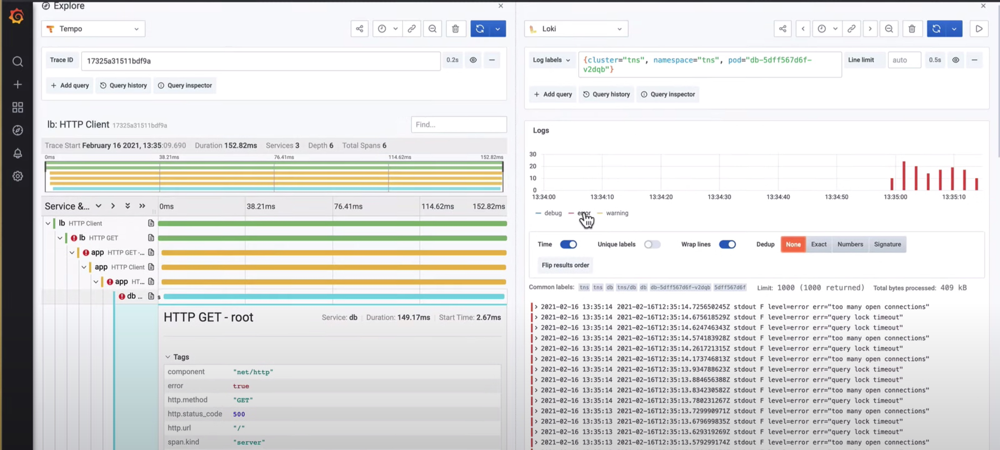
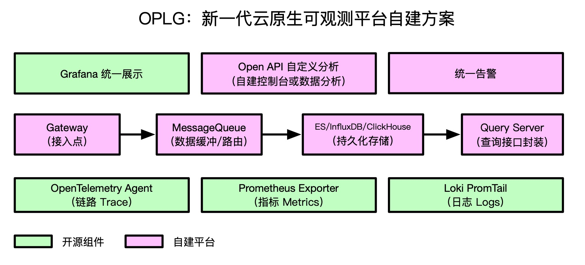
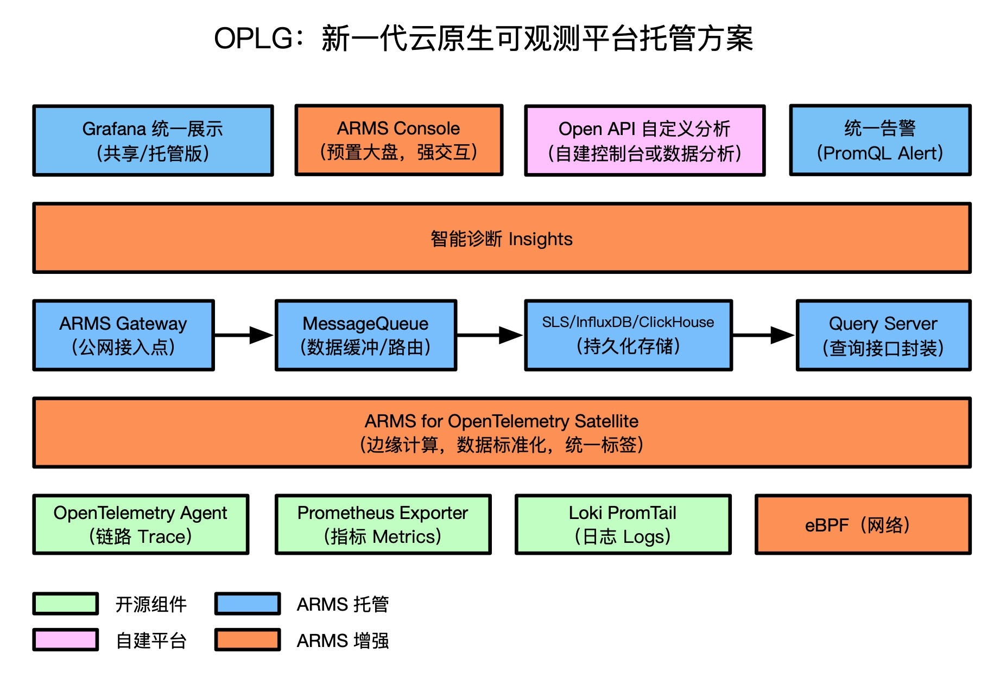
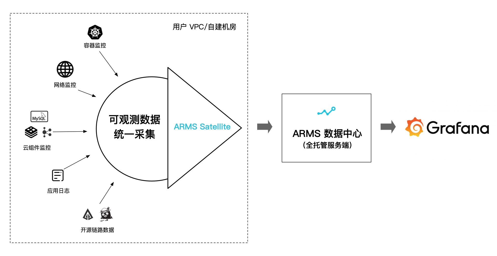
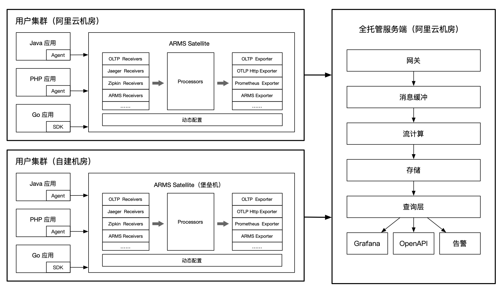
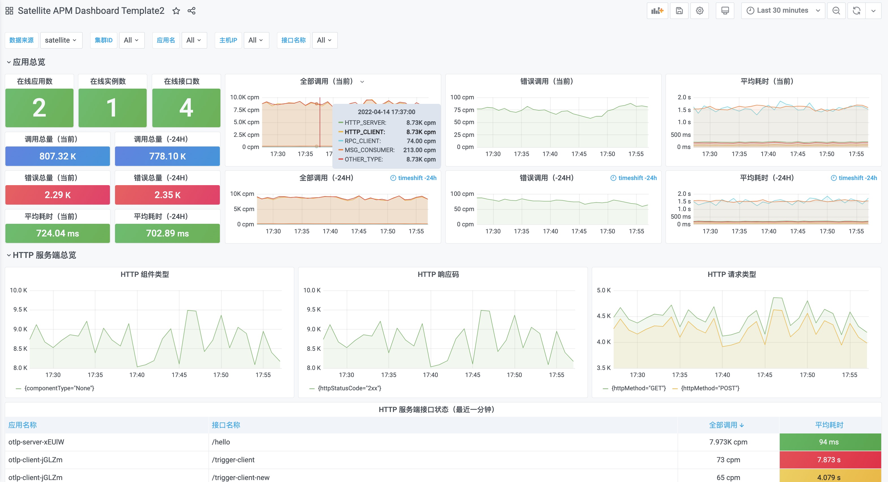

# OPLG：新一代云原生可观测最佳实践

> 作者：夏明（涯海）    
> 创作日期：2022-04-15  
> 专栏地址：[【稳定大于一切】](https://github.com/StabilityMan/StabilityGuide)  
> PDF 格式：[OPLG：新一代云原生可观测最佳实践](https://github.com/StabilityMan/StabilityGuide/blob/master/docs/processing/monitor/pdf/OPLG：新一代云原生可观测最佳实践.pdf)  

## OPLG 是什么
随着云原生架构的兴起，可观测的边界与分工被重新定义，传统的容器/应用/业务分层监控边界被打破，Dev、Ops、Sec 的分工逐渐模糊。大家意识到 IT 系统作为一个有机的整体，对 IT 系统状态的监测与诊断也需要一体化的方案。经过近几年的摸索与实践，基于 OPLG 的新一代云原生可观测体系，逐步成为了社区与企业的热门选择。

OPLG 是指将 (O)penTelemetry Traces、(P)rometheus Metrics、(L)oki Logs 通过 (G)rafana Dashboards 进行统一展示，满足企业级监控与分析的大部分场景，如下图所示（图片来源于 Youtobe Grafana Labs）。

基于 OPLG 体系可以快速构建一套覆盖云原生应用全栈的统一可观测平台，全面监测基础设施、容器、中间件、应用及终端用户体验，将链路、指标、日志、事件有机整合，更高效的达成稳定性运维与商业化分析目标。

## OPLG 自建方案
小明加入了一家潮牌买手公司，专门帮助年轻人寻找优质潮牌好货。随着业务规模的不断扩大，系统稳定性及商业化分析对全局可观测的要求也“水涨船高”，底层系统故障直接了影响业务营收与客户满意度。为此，小明所在的 IT 部门通过 OPLG 体系构建了一套全新的可观测平台，具备“快速接入、灵活扩展、无缝迁移、异构融合”等优势。

- 快速接入：由于 OpenTelemetry 和 Prometheus 社区提供的大量成熟的开源 SDK/Agent/Exporter，无需大量代码改造，即可快速接入主流组件与框架的链路追踪与指标监控。
- 灵活扩展：基于 PromQL/LogQL 灵活的查询语法，与 Grafana 丰富的大盘定制功能，可以满足各个业务线或运维团队的个性化可观测需求。
- 无缝迁移：考虑到数据安全性及未来海外业务发展规划，可观测平台沉淀的组件埋点、自定义大盘能够在不同云服务商之间无缝迁移。相比于商业化大盘深度锁定用户，Grafana 可以集成多种数据源，真正实现“端到端迁移自由”。
- 异构融合：Java、Go、Node.js 等不同语言的应用，以及多云环境的可观测数据能够互联互通，统一展示。

虽然 OPLG 体系具有多种优势，但是企业自建也会面临多重挑战，特别是在深度使用的过程中，许多规模化运维、性能、成本等非功能性问题将逐渐凸显。

- OT 组件规模化配置与升级：客户端探针的规模化管理几乎是运维团队的“梦魇”，探针异常引发的各种故障也是屡见不鲜。此外，动态配置下推与功能降级这类“保命大招”，通常也需要企业自建配置中心，自行开发与管理。
- Traces 全量采集与存储成本：中大型企业生产系统的日均调用量可以达到上亿级别，调用链全量上报和存储的成本是个不小的开销，对哪些链路进行采样成本最优？链路采样导致的指标监控与告警不准问题又该如何解决？
- Metrics 大体量查询性能：一次查询扫描的指标数越多，查询性能越差。当查询时间范围超过一周或者一个月时，经常会遇到查询卡顿甚至于无法查询出结果。此外，APM Metrics 还会经常遇到 URL / SQL 发散导致的指标线过多，打爆存储与查询层。
- 海量告警调度时延与性能：每一条告警规则都代表着一个定期轮询任务，当告警规则超过千级别，甚至万级别时，经常会遇到告警延迟发送，甚至无法发送的情况，错失了故障排查的最佳时机。
- 组件容灾能力弱：多地域/可用区容灾，是保障服务高可用的重要手段。但是，由于容灾能力建设，需要技术与资源的双重投入，很多企业自建系统都不具备容灾能力。

上述问题都是企业自建可观测体系过程中会遇到的经典问题，这些由于规模带来的性能及可用性问题，需要投入大量研发和时间进行沉淀，大幅增加了企业运维成本。因此，越来越多的企业选择将可观测服务端托管给云服务商，在享受开源方案技术红利的同时，也能得到持续、稳定的服务保障。

## OPLG 托管方案
为了降低运维成本，更稳定的提供可观测服务，小明所在的 IT 部门决定采用由阿里云 ARMS 提供的 OPLG 托管方案，该方案在保留开源方案优势的基础上，提供了高性能、高可用、免运维的后端服务，帮助小明团队解决了海量数据场景下的规模化运维难题。此外，通过 eBPF 网络探测、Satellite 边缘计算和 Insights 智能诊断，进一步提升了可观测数据的覆盖度和集成度，如下图所示。

- 高性能：支持无损统计，数据压缩，连接优化，发散指标自动收敛，DownSample 等技术，大幅降低海量数据场景下的性能开销。
- 高可用：客户端支持资源限额与自动限流保护，保证高压场景下的集群稳定性；后端服务支持弹性水平扩容，多地域/多可用区容灾，尽最大可能保障服务可用性。
- 灵活易用：JavaAgent 和 OT Collector 托管升级，无需用户管理；支持动态配置下推，实时调整流量开关，调用链采样率，接口过滤与收敛规则等参数。
- 网络探测：通过 eBPF 无侵入地分析网络请求，自动解析网络协议，构建网络拓扑，展示特定容器之间或容器与特定云产品实例之间的网络性能。
- 边缘计算：通过 Satellite（OpenTelemetry Collector）实现了可观测数据在用户集群内的边缘采集与计算能力，规范数据格式，统一数据标签，有效提升 Trace/Metrics/Logs 数据之间的关联度。
- 智能诊断：结合多年沉淀的领域知识库和算法模型，对常见线上故障问题（如慢SQL、流量不均）进行定期巡检，自动给出具体的根因分析与建议。

### ARMS for OpenTelemetry Satellite
近两年 OpenTelemetry 和 SkyWalking 等社区都在大力研发边缘采集与计算 Satellite 方案。ARMS for OpenTelemetry Satellite（简称ARMS Satellite）是一套基于 OpenTelemetry Collector 开发的可观测数据（Traces、Metrics、Logs）边缘侧统一采集与处理平台，具备安全、可靠、易用等特性，适合生产环境接入。

ARMS Satellite通过边缘侧的数据采集、处理、缓存与路由，可以实现多源异构数据的标准化；增强Traces、Metrics、Logs可观测数据间的关联性；支持无损统计，降低数据上报和持久化存储成本等。

#### 适用场景一：全景监控数据一键采集与分析（容器环境）
ARMS Satellite 在容器服务 ACK 环境下，深度集成了阿里云 Kubernetes 监控组件与 Prometheus 监控组件，一键安装完成后，会自动采集 K8S 容器资源层和网络性能数据。结合用户上报的应用层数据（只需修改 Endpoint，无代码改造）与自动预聚合指标，全部上报至全托管的服务端数据中心，再通过 Grafana 进行统一展示。最终实现覆盖应用、容器、网络、云组件的全景监控数据采集与分析。

#### 适用场景二：多云/混合云网络，异构 Tracing 框架数据关联与统一展示
在多云/混合云架构下，不同集群或应用间的链路追踪技术选型可能存在差异，比如 A 采用了 Jaeger，B 采用了 Zipkin，不同链路追踪协议上报的数据格式互不兼容，无法串联，大幅降低了全链路诊断效率。

通过 ARMS Satellite 可以将不同来源的链路统一转化为 OpenTelemetry Trace 格式，并上报至统一的服务端进行处理和存储，用户可以轻松实现跨网络或异构链路框架的联合数据查询与分析。

#### 适用场景三：链路采样+无损统计，低成本实现应用监控告警精准统计
生产系统的日均调用量可以达到亿级别，调用链全量上报和存储的成本是个不小的开销，对调用链执行采样存储是个不错的选择。然而，传统的链路采样会导致链路统计指标的准确性大幅下降，比如一百万次真实调用经过 10% 采样后保留的十万次调用，对其统计得到的结果会产生明显的“样本倾斜”，最终导致监控告警误报率过高，基本处于不可用状态。

ARMS Satellite 支持 Trace 数据无损统计，对接收到的 Trace 数据自动进行本地预聚合，得到精准的统计结果后再执行链路采样上报，这样在降低网络开销和持久化存储成本的同时，保证了应用监控与告警指标的准确性。默认集成的 Satellite APM Dashboard 如下图所示。

## 总结
OPLG 体系拥有成熟且富有活力的开源社区生态，同时也经过了大量企业生产环境的实践检验，是当下建设新一代云原生统一可观测平台的热门选择。但是，OPLG 只是提供了一个技术体系，如何灵活运用，解决实际问题，沉淀出通用行业或场景的最佳实践，还需要大家一起来探索。

## 相关链接

- [OpenTelemetry](https://opentelemetry.io/)
- [Prometheus](https://prometheus.io/)
- [Grafana Loki](https://grafana.com/oss/loki/)
- [Grafana Labs](https://grafana.com/)
- [ARMS for OpenTelemetry Satellite  —— 助力边缘可观测](https://help.aliyun.com/document_detail/418462.html)
- [阿里云 Prometheus 监控](https://help.aliyun.com/document_detail/195983.html)
- [阿里云 Kubernetes 监控](https://help.aliyun.com/document_detail/260777.html)
- [阿里云 Grafana 服务](https://help.aliyun.com/document_detail/311928.html)

## 推荐社区
【稳定大于一切】打造国内稳定性领域知识库，**让无法解决的问题少一点点，让世界的确定性多一点点。**

- GitHub 专栏地址 ([https://github.com/StabilityMan/StabilityGuide)](https://github.com/StabilityMan/StabilityGuide))
- 钉钉交流群号：30000312
- 如果阅读本文有所收获，欢迎分享给身边的朋友，期待更多同学的加入！
